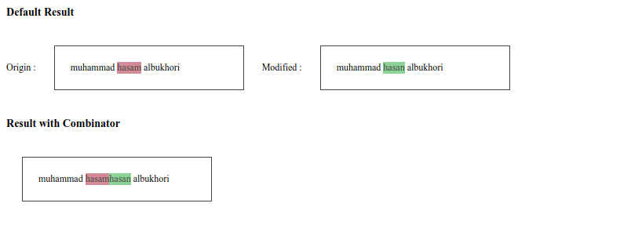

# Diff-tool

Simple tool to compare 2 string.

## installation

1. Clone this repository
```bash
git clone https://github.com/defrindr/diff-tool
```

2. Move ```diff.php``` to directory project

3. And call it, if you need it.


## List Function


<table>
    <thead>
        <th>Name</th>
        <th>Params</th>
        <th>Description</th>
    </thead>
    <tbody>
        <tr>
            <td rowspan="3">Compare</td>
            <td>$origin_string</td>
            <td>
                Contain origin text, this param can`t be blank
            </td>
        </tr>
        <tr>
            <td>$modified_text</td>
            <td>
                Contain modification text, this param can`t be blank
            </td>
        </tr>
        <tr>
            <td>$combine_string</td>
            <td>
                default value is false
            </td>
        </tr>
    </tbody>
</table>

## Example


### Run sample

To run simple example.

1. Go to repository dir

2. Run this command
```bash
./run
```

### Screen Shot


